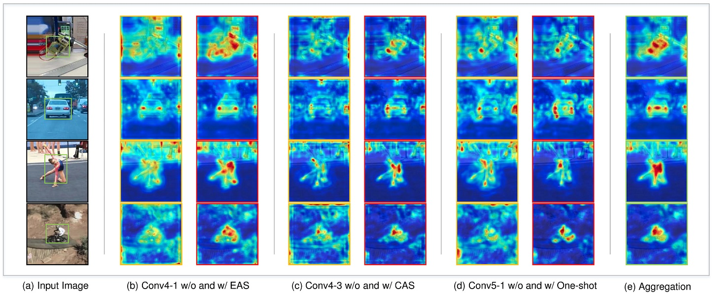

# Learning Deep Convolutional Descriptor Aggregation for Efficient Visual Tracking [[Paper]](https://link.springer.com/article/10.1007/s00521-021-06638-8)
 
This work aims to mine the target representation capability of a pre-trained model, and presents deep convolutional descriptor aggregation (DCDA) for visual tracking. Based
on spatial and semantic priors, we propose an edge-aware selection (EAS) and a central-aware selection (CAS) method to aggregate the accuracy-aware and robustness-aware features. To make full use of the scene context, our method is derived from one-shot learning by designing a dedicated regression process that is capable of predicting discriminative model in a few iterations. By exploiting robustness feature aggregation, the accuracy feature aggregation, and the discriminative regression, our DCDA with Siamese tracking architecture not only enhances the target prediction capacity, but also achieves a lowcost reuse of the pre-trained model.

    

<!-- ## Framework

    

 -->

## Code
Source code will be made public after appropriate refactoring. A naive version can be found at [[VOT Challenge]](https://www.votchallenge.net/vot2020/trackers.html).

## Results
### OTB
Raw results on OTB-2015 [[results]](raw_results/DCDA_OTB2015.zip).
|  Method | Dataset |  Success  |  Precision|   
|  :----: |  :----: | :----: |  :----: |
|   DCDA  | OTB-2015|   0.661 |  0.870   |

<!-- 

    

 -->

### VOT
Raw results on VOT2016 [[results]](raw_results/DCDA_VOT2016.zip), VOT2017 [[results]](raw_results/DCDA_VOT2017.zip).

We also develop a version with [[AlphaRefine]](https://github.com/MasterBin-IIAU/AlphaRefine), and evaluated on VOT2021 .
| Method | Dataset  |  Acc.  |  Rob.   |  EAO   |
|  :----:|  :----:  | :----: |  :----: | :----: |
|  DCDA  | VOT2016  |  0.5537 |  0.8167|  0.3462  |
|  DCDA  | VOT2017  |  0.5608 | 1.2332  |   0.2747   |
|  DCDA  | VOT2020[1]  |  0.456 |  0.635   |  0.236  |
|  DCDA+AR  | VOT2021[2]  |  0.709 |  0.625   |  0.355  |

[1,2] The VOT2020 and VOT2021 use a new eval protocol.

### NFS
Raw results on NFS30 and NFS240 [[results]](raw_results/DCDA_NFS30_NFS240.zip).

|  Method | Dataset |  Success  |  Precision|   
|  :----: |  :----: | :----: |  :----: |
|   DCDA  | NFS 30|   0.444 |  0.520   |
|   DCDA  | NFS 240|   0.524 |  0.660   |

